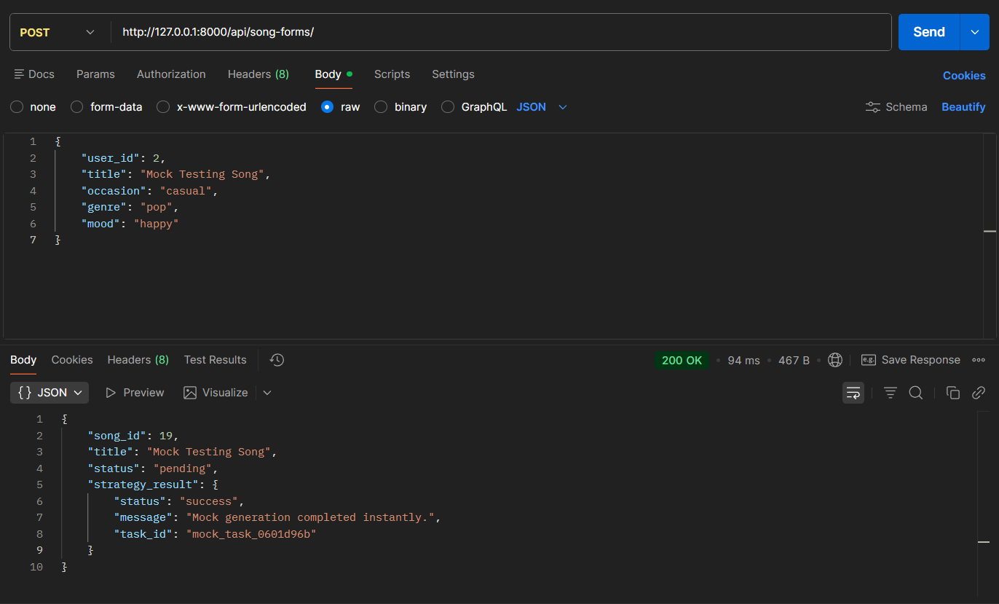
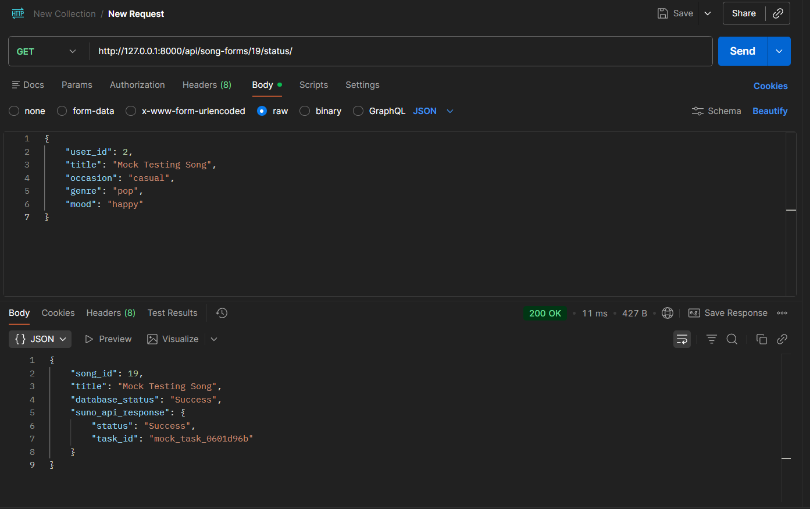
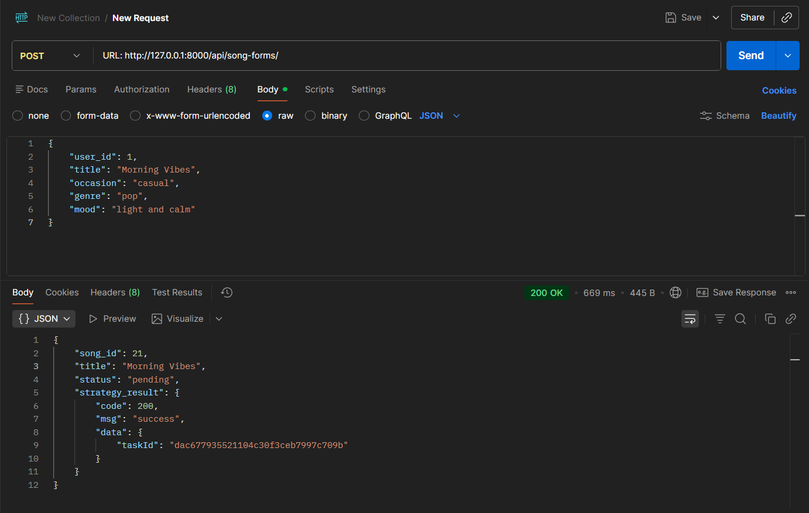
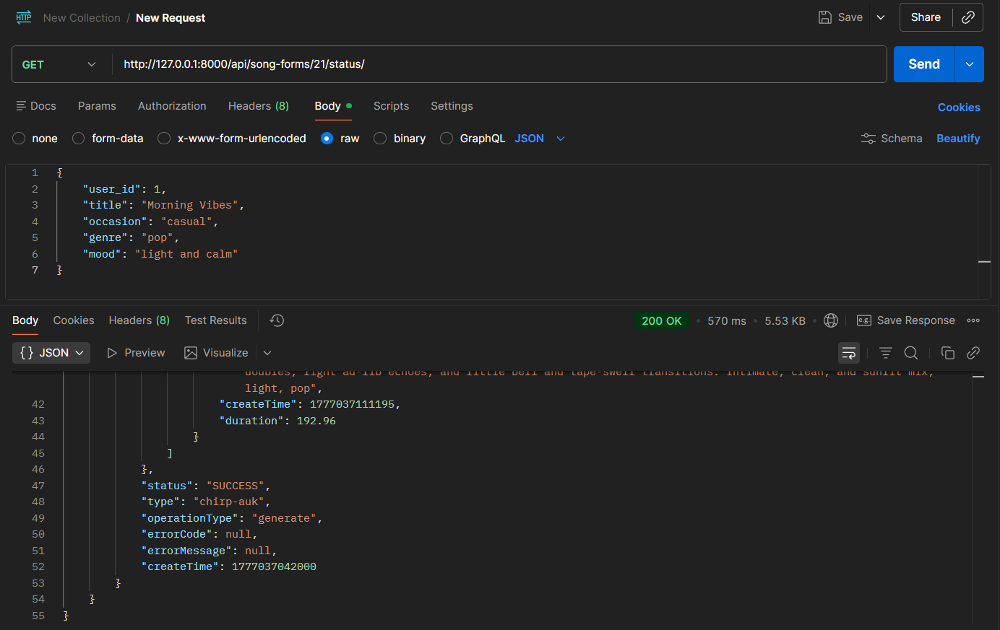

# Chitara - AI Music Generation App (Domain Layer)

This repository contains the Django domain layer implementation for **Chitara**, an AI music generation web application. This project focuses strictly on the core business entities and database persistence as outlined in the system requirements.

## Domain Model Justification (Design Decisions)
This implementation translates the provided Domain Model into Django ORM models following these specific design decisions:

* **Core Entities:** The main domain classes (`User`, `Song`, `Notification`) were implemented as standard Django models.
* **Value Types (Enumerations):** Attributes that represent fixed, predefined sets (`Mood`, `Genre`, `VoiceType`, `Occasion`, `GenerateStatus`, `NotificationType`) were implemented using Django's `models.TextChoices` to enforce data integrity at the database level.
* **Relationships & Rules:**
    * **User & Song Lifecycle:** A `ForeignKey` was used on the `Song` model to link it to a `User`, enforcing the rule that each song belongs to exactly one user. Additionally, `SongGenerationRequest` was merged into the `Song` model to reflect that the generation input and the generated output belong to the same lifecycle entity.
    * **Notifications:** A `ForeignKey` was used on the `Notification` model to associate it with a `User`, allowing the system to properly record user actions (generation success/fail, delete, share, download).
    * **Playback:** Playback ("plays") is treated as a simple association rather than a stored database model because no playback history is stored in the system.
* **System Exclusions:** UI components, technical implementations, and external systems (like Google OAuth) were intentionally excluded from the domain models to keep the focus strictly on the business core.

---

# Setup & Installation
## git clone
```cmd
git clone https://github.com/maxmukdakul/chitara_project.git
```
```cmd
cd chitara_project
```

## create venv
```cmd
python -m venv venv
```
## Activate the virtual environment
   - **macOS/Linux:**
     ```bash
     source venv/bin/activate
     ```
   - **Windows:**
     ```cmd
     .\venv\Scripts\activate
     ```

## install dependencies
```cmd
pip install -r requirements.txt
```

## apply Database Migrations
```cmd
python manage.py makemigrations domain
```
```
python manage.py migrate
```

## create an admin superuser
```cmd
python manage.py createsuperuser
```

## run
```cmd
python manage.py runserver
```

## go to
http://127.0.0.1:8000/admin/


# Exercise 4: Strategy Pattern (Song Generation)

This phase of the project implements the Strategy Design Pattern to support multiple interchangeable song generation behaviors without altering the core domain logic

## Environment Setup & Security
To run the generation strategies, you must create a `.env` file in the root directory (next to `manage.py`).

Create your `.env` file with this structure:
```python
GENERATOR_STRATEGY=mock
# Change to 'suno' to use the real AI generator
SUNO_API_KEY=your_real_api_key_here
```


## How to Test in Postman
To prove both strategies work, start your server by running ```python manage.py runserver``` in your terminal. Leave it running, and open the Postman app.(dont forget to open the venv first)

### Step 1: Create a Domain User (Do this once)
Django superusers do not count as domain users. You must create a user through this API first before generating any songs.

Method: POST

URL: http://127.0.0.1:8000/api/users/

Body (raw JSON):
```
{
    "name": "Testing User",
    "google_oauth_id": "test_id_123"
}
```

Send! Make note of the user_id returned (e.g., 1).

### Step 2: Testing MOCK Mode
This mode is offline and simulates a fast generation.

Set up .env: Make sure your .env says ```GENERATOR_STRATEGY=mock```. Restart your Django server if you changed it.

### Generate the Song:

Method: POST

URL: http://127.0.0.1:8000/api/song-forms/

Body (raw JSON):

```
{
    "user_id": 1,
    "title": "Mock Testing Song",
    "occasion": "casual",
    "genre": "pop",
    "mood": "happy"
}
```

Send! It will return a song_id and a mock task ID.



### Check Status:

Method: GET

URL: http://127.0.0.1:8000/api/song-forms/<your_song_id>/status/

Send! You will immediately see the mock status response confirming it works offline.



### Step 3: Testing SUNO Mode
This mode connects to the real AI and takes a few minutes to render audio.

Set up .env: Change your .env to ```GENERATOR_STRATEGY=suno``` and ensure ```SUNO_API_KEY``` is filled in. Restart your Django server.

### Generate the Song:

Method: POST

URL: http://127.0.0.1:8000/api/song-forms/

Body (raw JSON):

```
{
    "user_id": 1,
    "title": "Morning Vibes",
    "occasion": "casual",
    "genre": "pop",
    "mood": "light and calm"
}
```

Send! It will return a song_id and a status: pending. The AI is now working in the background.(And remember the song_id)



### Check Status (Polling):

Method: GET

URL: http://127.0.0.1:8000/api/song-forms/<your_song_id>/status/

Send! If you check immediately, the Suno API response will say PENDING. Wait about 2-3 minutes and hit Send again. It will eventually change to SUCCESS and return the playable audioUrl links!


