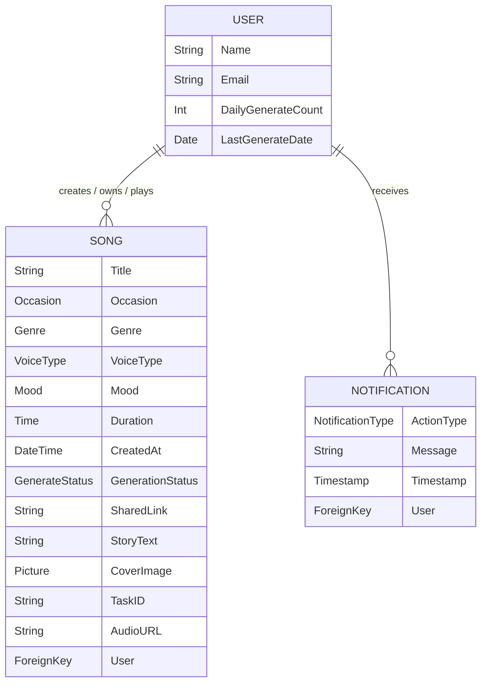
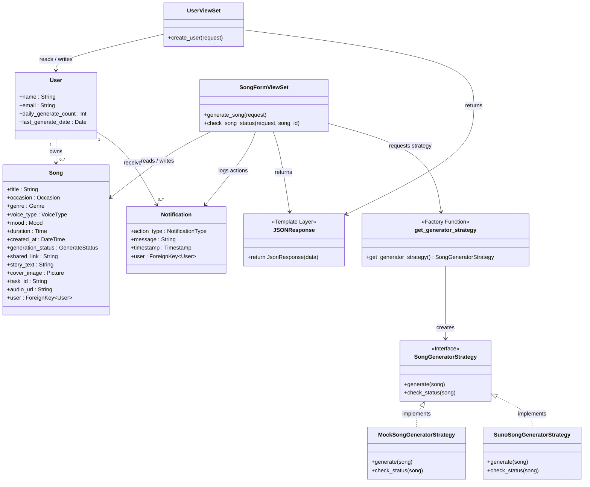
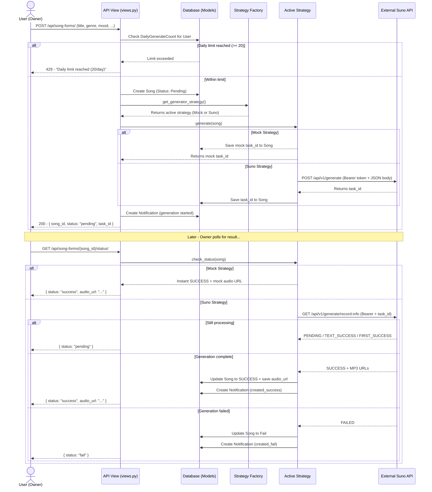
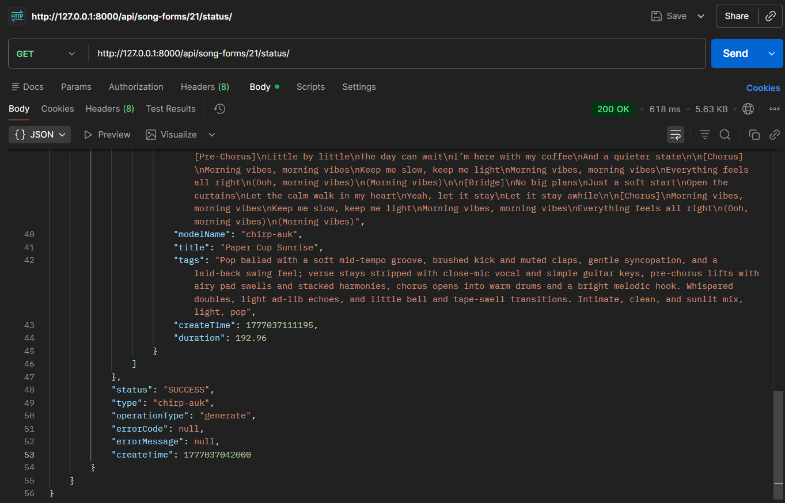

# 🎵 Chitara — AI Music Generation App

Chitara is a Django-based AI music generation web application.  
The system supports real song generation via the Suno API and a mock offline strategy for development and testing. It includes both a REST API for programmatic access and a full web interface for user interaction.

This implementation was developed for **Exercise 4: Apply Strategy Pattern for Song Generation**, building on the domain layer from Exercise 3.

---

## Project Overview

The system supports the following core flow:

1. A **User** is created via the web interface with Google OAuth or the API.
2. The user submits a **Song Form** (title, occasion, genre, mood, optional story/image).
3. The system generates a **Song** using the active strategy (Mock or Suno API).
4. The song is stored in the database with a `Pending` status and a `task_id`.
5. The user polls the **status endpoint** to check generation progress.
6. On success, the song is updated to `Success` with a live `audio_url`.
7. All actions (generation success/fail) are recorded as **Notifications**.

---

## Main Features

- **Strategy Pattern** for song generation (Mock vs Suno API, swappable via env var)
- **Mock strategy** — offline, deterministic, instant result, no API calls required
- **Suno API strategy** — real AI generation via SunoApi.org with status polling
- Daily generation limit enforcement (20 songs/user/day)
- Notification logging for all generation events
- Django admin panel support
- REST API with JSON responses and a full web interface for user interaction

---

## Domain Entities

- **User** — the authenticated creator who owns and manages songs
- **Song** — the generated music artifact (merged with `SongGenerationRequest`)
- **Notification** — log of user actions (generation success/fail, delete, share, download)

### Value Types (Enumerations)

- `Mood` — Happy, Sad, Romantic, Energetic, …
- `Genre` — Pop, Rock, Jazz, Lo-fi, …
- `VoiceType` — Male, Female
- `Occasion` — Birthday, Wedding, Party, …
- `GenerateStatus` — Pending, Success, Fail
- `NotificationType` — created_success, created_fail, deleted, shared, downloaded

---

## Domain Relationships

- One **User** can create 0..* **Songs**
- One **Song** belongs to exactly one **User**
- One **User** can receive 0..* **Notifications**
- One **Song** has exactly one status lifecycle (Pending → Success / Fail)
- **Playback** is a simple association — no playback history is stored

---

## Project Structure

```text
chitara_project/
│
├── manage.py
├── requirements.txt
├── .env                          ← Never committed — configure locally
├── .gitignore
│
├── config/                       ← Django project config
│   ├── settings.py
│   ├── urls.py
│   ├── asgi.py
│   └── wsgi.py
│
└── domain/                       ← Main application (MVT architecture)
    │
    ├── models/                   ← Model Layer
    │   ├── user.py               # User model
    │   ├── song.py               # Song model
    │   ├── notification.py       # Notification model
    │   └── choices/              # Enumerations (TextChoices)
    │       ├── mood.py           # Mood enum
    │       ├── genre.py          # Genre enum
    │       ├── voice_type.py     # VoiceType enum
    │       ├── occasion.py       # Occasion enum
    │       ├── generate_status.py    # GenerateStatus enum
    │       └── notification_type.py  # NotificationType enum
    │
    ├── generation/               ← Strategy Pattern
    │   ├── base.py               # SongGeneratorStrategy (abstract interface)
    │   ├── mock.py               # MockStrategy (offline implementation)
    │   ├── suno.py               # SunoStrategy (Suno API implementation)
    │   └── factory.py            # StrategyFactory (centralized selection)
    │
    ├── views.py                  ← View Layer (UserViewSet + SongFormViewSet)
    ├── urls.py
    ├── admin.py
    ├── apps.py
    └── tests.py
```

---

## Domain Model



### Design Decisions

- `SongGenerationRequest` was **merged into `Song`** — generation input and output belong to the same lifecycle entity.
- **Playback** is a simple association; no playback history is stored in the database.
- **External systems** (Google OAuth) are excluded from the domain model.
- Enumerations are implemented as Django `TextChoices` to enforce data integrity at the database level.
- `task_id` and `audio_url` are stored on the Song model to support async generation and status polling.

### Business Rules

- A user can generate at most **20 songs per day**.
- Each song belongs to exactly one user.
- Only the owner can delete, download, or share their song.
- A listener can access a song via shared link but **cannot** add it to their own library.
- If generation fails, no song is persisted in the system.
- Notifications must record: generation success/fail, deletion, sharing, and download events.

### Traceability

| Class | Derived From (SRS) |
|---|---|
| User | FR1–FR5 |
| Song | FR6–FR8, FR16–FR29 |
| Notification | FR30–FR31 |

---

## Class Diagram (MVT Architecture)

The class diagram follows Django's **MVT (Model-View-Template)** pattern. In this REST API project, the View layer lives in `domain/views.py` and returns JSON responses directly (`JsonResponse`), which serves as the Template layer output.



---

## Sequence Diagram — Song Generation Use Case



---

## Strategy Pattern: Song Generation

This project implements the **Strategy design pattern** to allow swappable song generation behavior without modifying views or any other part of the system.

### Strategy Interface

Defined in `domain/generation/base.py`:

```python
from abc import ABC, abstractmethod

class SongGeneratorStrategy(ABC):

    @abstractmethod
    def generate(self, song) -> dict:
        """
        Submits a generation request.
        Returns: { 'task_id': str }
        """
        pass

    @abstractmethod
    def check_status(self, song) -> dict:
        """
        Checks generation status for a song.
        Returns: { 'status': str, 'audio_url': str | None }
        """
        pass
```

### Strategy Selection

Centralized in `domain/generation/factory.py` — no `if/else` logic is scattered anywhere else in the codebase:

```python
from django.conf import settings
from .mock import MockSongGeneratorStrategy
from .suno import SunoSongGeneratorStrategy

def get_generator_strategy():
    """Returns the configured generation strategy."""
    strategy = getattr(settings, 'GENERATOR_STRATEGY', 'mock').lower()

    if strategy == 'suno':
        return SunoSongGeneratorStrategy()

    # Defaults to mock for safety
    return MockSongGeneratorStrategy()
```

---

## Installation and Setup

### 1. Clone the repository

```bash
git clone https://github.com/maxmukdakul/chitara_project.git
cd chitara_project
```

### 2. Create and activate a virtual environment

**macOS / Linux:**
```bash
python3 -m venv venv
source venv/bin/activate
```

**Windows:**
```bash
python -m venv venv
venv\Scripts\activate
```

### 3. Install dependencies

```bash
pip install -r requirements.txt
```

### 4. Create a `.env` file

> ⚠️ **Never commit `.env` — it contains secrets.** It is listed in `.gitignore`.

```env
# Strategy selector: 'mock' or 'suno'
GENERATOR_STRATEGY=mock

# Required only when GENERATOR_STRATEGY=suno
SUNO_API_KEY=your_real_api_key_here
```

### 5. Apply migrations

```bash
python manage.py makemigrations domain
python manage.py migrate
```

### 6. Create a superuser

```bash
python manage.py createsuperuser
```

### 7. Run the server

```bash
python manage.py runserver
```

- API: `http://127.0.0.1:8000/api/`
- Admin: `http://127.0.0.1:8000/admin/`
- Web App: `http://127.0.0.1:8000/`

---

## Running in Mock Mode (Offline)

Set in `.env`:

```env
GENERATOR_STRATEGY=mock
```

Restart the server. Mock mode produces a deterministic song instantly. No API key or internet required.

**Example — Generate response:**
```json
{
    "song_id": 1,
    "status": "pending",
    "task_id": "mock-task-001"
}
```

**Example — Status response:**
```json
{
    "status": "success",
    "audio_url": "http://mock-audio.example.com/song.mp3"
}
```

---

## Running in Suno Mode (Live API)

Set in `.env`:

```env
GENERATOR_STRATEGY=suno
SUNO_API_KEY=your_api_key_here
```

Restart the server. Suno mode calls `POST https://api.sunoapi.org/api/v1/generate`, stores the returned `taskId`, and updates the song on polling.

**Example — Generate response (initial):**
```json
{
    "song_id": 3,
    "status": "pending",
    "task_id": "abc123xyz"
}
```

**Example — Status response after ~2–3 minutes:**
```json
{
    "status": "success",
    "audio_url": "https://cdn.suno.ai/generated/abc123xyz.mp3"
}
```

---

## API Endpoints & Testing (Postman)

> ⚠️ Django superusers are **not** domain users. Create a domain user via the API first.

### Step 1 — Create a Domain User

```
POST http://127.0.0.1:8000/api/users/
```
```json
{
    "name": "Testing User",
    "email": "test@example.com"
}
```

### Step 2 — Generate a Song

```
POST http://127.0.0.1:8000/api/song-forms/
```
```json
{
    "user_id": 1,
    "title": "Morning Vibes",
    "occasion": "casual",
    "genre": "pop",
    "mood": "happy"
}
```


### Step 3 — Check Song Status (Poll)

```
GET http://127.0.0.1:8000/api/song-forms/{song_id}/status/
```

- **Mock mode:** Returns `success` immediately.
- **Suno mode:** Poll every 30–60 seconds. Returns `success` with `audio_url` after ~2–3 minutes.




---

## Route Structure

| Prefix | Description |
|---|---|
| `POST /api/users/` | Create domain users |
| `POST /api/song-forms/` | Submit song generation form |
| `GET /api/song-forms/{id}/status/` | Poll generation status |
| `/admin/` | Django admin panel |
| `/` | Web interface (home page) |
| `/users/check/` | Check if user exists (for Google login) |
| `/users/{id}/library/` | Get user's song library |
| `/users/{id}/notifications/` | Get user's notification history |
| `/song-forms/` | Submit song generation (web) |
| `/songs/shared/{id}/` | Shared song playback |

---

## Web Interface

Chitara now includes a full web interface built with HTML, CSS (Tailwind CSS), and JavaScript, providing a user-friendly way to interact with the application without needing external API tools like Postman.

### Accessing the Web App

- After starting the server (`python manage.py runserver`), visit `http://127.0.0.1:8000/` in your browser.
- The web app handles user authentication, song generation, library management, and more.

### Web Features

- **Google OAuth Login**: Sign in with your Google account. New users are prompted to set a display name.
- **Song Library**: View all your generated songs, with status indicators (Pending, Success, Fail).
- **Generate Songs**: Use an intuitive form to create new songs with title, occasion, genre, mood, voice type, optional story, and cover image.
- **Review Before Generation**: Preview your song details before submitting for generation.
- **Audio Player**: Play songs directly in the browser with a global player at the bottom of the screen.
- **Actions**: Download, share (generate shareable links), and delete songs.
- **Notifications History**: View your activity log (generation success/fail, deletions, etc.).
- **Daily Limit Enforcement**: Alerts if you exceed 20 songs per day.
- **Responsive Design**: Works on desktop and mobile devices using Tailwind CSS.

### Using the Web Interface

1. **Start the Server**: Run `python manage.py runserver` and visit `http://127.0.0.1:8000/` in your browser.

2. **Sign In**: Click the Google Sign-In button. For new users, enter a display name when prompted.

3. **View Your Library**: After login, you'll see your song library. If empty, generate your first song.

4. **Generate a Song**: Click "+ Generate Song", fill in the form (title, occasion, genre, mood, voice type, optional story/image), review, and submit.

5. **Monitor Progress**: Songs start as "Pending". The library auto-refreshes; successful songs show play/download/share options.

6. **Play Songs**: Click "Play" to use the bottom player. Skip to the next song automatically.

7. **Manage Songs**: Use "Download" to save, "Share" to get a link, or "X" to delete.

8. **View History**: Click "🔔 History" to see notifications of your actions.

9. **Share Links**: Shared links allow others to listen without an account.


---

## Application Completeness

| Feature | Status | Notes |
|---|---|---|
| Domain models (User, Song, Notification) | ✅ Done | Fully implemented as Django models |
| Strategy Pattern (Mock + Suno) | ✅ Done | Swappable via `.env` |
| Song generation endpoint | ✅ Done | `POST /api/song-forms/` |
| Song status polling endpoint | ✅ Done | `GET /api/song-forms/{id}/status/` |
| User creation endpoint | ✅ Done | `POST /api/users/` |
| Daily generation limit (20/day) | ✅ Done | Enforced in view layer |
| Admin panel | ✅ Done | `http://127.0.0.1:8000/admin/` |
| Notification logging | ✅ Done | Model and web endpoints implemented; API endpoint available |
| Song delete / share / download | ✅ Done | Implemented in web interface; API endpoints defined but not exposed |
| Google OAuth login | ✅ Done | Implemented in web interface for user authentication |
| Frontend / UI | ✅ Done | Full web interface with Google OAuth, song generation, library, player, and notifications |

---

## Notes

- Authentication (Google OAuth) is implemented in the web interface for user login; API access still allows direct user creation for testing.
- Strategy selection is controlled entirely by the `GENERATOR_STRATEGY` setting, read via `getattr(settings, 'GENERATOR_STRATEGY', 'mock')`.
- `.env` must **never** be committed — it is listed in `.gitignore`.
- The domain model intentionally excludes external systems (Google OAuth) to keep the business core clean.
- `SongGenerationRequest` was merged into `Song` to reflect that generation input and output are the same lifecycle entity.
- The strategy files (`mock.py`, `suno.py`, `base.py`) use short names for brevity. The full class names (`MockSongGeneratorStrategy`, `SunoSongGeneratorStrategy`, `SongGeneratorStrategy`) are consistent within the codebase.

---

## Future Improvements

- Expose Notification history via a dedicated API endpoint (already available in web)
- Implement song delete, share, and download endpoints (FR25–FR27) as public API
- Listener access tracking for shared songs
